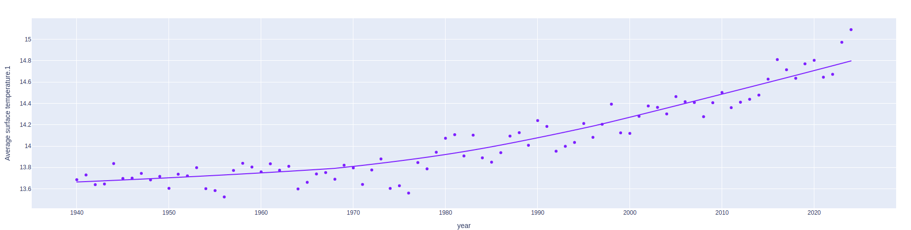
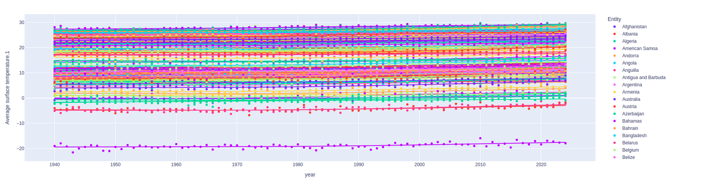
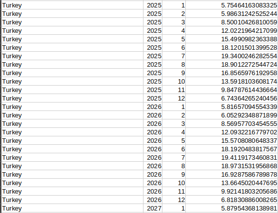

 

#  Monthly Surface Temperature Prediction (1940-2035)

This project analyzes global surface temperatures using the **Average Monthly Surface Temperature (1940-2024)** dataset and applies machine learning models to predict monthly average temperatures from 2025 to 2035.

##  Dataset
The dataset is sourced from **Kaggle**:  
🔗 [Average Monthly Surface Temperature (1940-2024)](https://www.kaggle.com/datasets/samithsachidanandan/average-monthly-surface-temperature-1940-2024)

- **Time Period**: 1940 - 2024
- **Features**: Year, Month, Average Surface Temperature (°C)
- **Objective**: Predict future temperature trends using machine learning models.

---

###  Dataset Visualizations
Below are the raw data visualizations:

#### **Global Surface Temperature Trends (1940-2024)**
This graph shows the **worldwide average surface temperature trend** over the years without considering country-specific variations.

#### **Country-wise Temperature Trends (1940-2024)**
This graph presents **temperature variations across different countries** over the years, providing insights into regional climate changes.

---

##  Machine Learning Models Used
The following machine learning models were applied for prediction:

1. **Linear Regression**
2. **Polynomial Regression**
3. **Support Vector Regression (SVR)**
4. **Decision Tree**
5. **Random Forest**

###  Model Performance Comparison
The table below presents the **R² score**, **MAE**, **MSE**, and **RMSE** for each model.

| Model | R² Score | MAE | MSE | RMSE |
|--------|--------|--------|--------|--------|
| **Linear Regression** | 0.6961 | 3.9686 | 30.7695 | 5.5470 |
| **Polynomial Regression** | 0.8423 | 2.8181 | 15.9607 | 3.9951 |
| **SVR (Poor Performance!)** | -3.6246 | 19.6391 | 468.1811 | 21.6375 |
| **Decision Tree** | 0.7572 | 3.3412 | 24.5820 | 4.9580 |
| **Random Forest** | 0.7987 | 3.2953 | 20.3770 | 4.5141 |

 **Conclusion**: **Polynomial Regression** achieved the highest **R²** score and the lowest error values, making it the best-performing model.

---

##  Future Predictions (2025-2035)
- **Polynomial Regression** was used to predict the global monthly average surface temperatures for **2025-2035**.
- The predicted values were analyzed.

### 🌍 **Sample Prediction Output**
Below is an example of **a portion of the obtained data**, specifically showing predictions related to Turkey:

---

 Contact
If you have any questions or suggestions regarding this project, feel free to reach out:

📩 Email: onurhanakbulut.ai@gmail.com

🔗 GitHub: onurhanakbulut

If you would like to contribute to this project, feel free to submit a Pull Request or open a new Issue! ⭐

